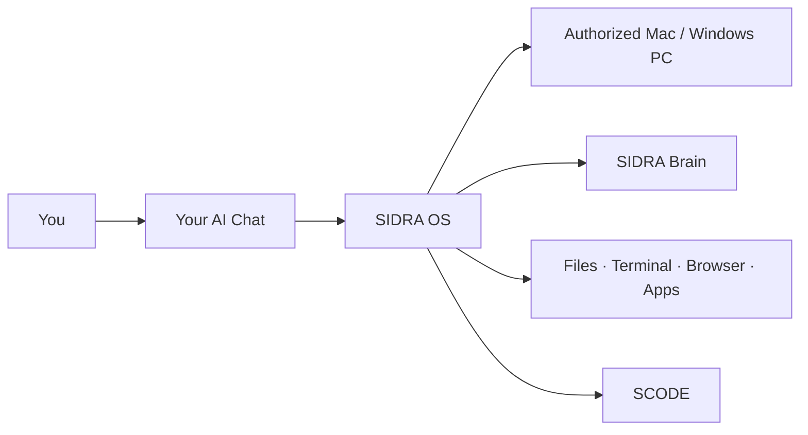
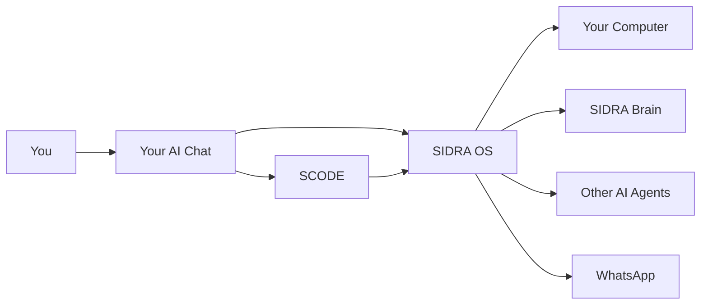
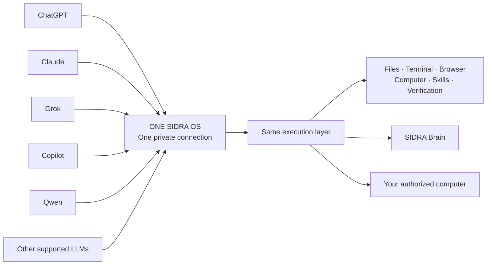

<p align="center">
  
</p>

<h1 align="center">SIDRA OS</h1>

<p align="center">
  <strong>CHAT IS THE BRAIN. SIDRA IS THE HANDS.</strong>
</p>

<p align="center">
  Turn ChatGPT, Claude, Grok & Qwen into real agents on your computer.
</p>

<p align="center">
  ChatGPT · Claude · Grok · Copilot · Qwen · other supported AI clients
</p>

<p align="center">
  
  
  
</p>

<p align="center">
  <a href="https://agent.sidra-ai.com/start?utm_source=github&utm_medium=organic&utm_campaign=sidra_os&utm_content=flagship_readme"></a>
  <a href="https://agent.sidra-ai.com/?utm_source=github&utm_medium=organic&utm_campaign=sidra_os&utm_content=flagship_readme"></a>
  <a href="https://youtu.be/Af_HYzlIH_o"></a>
</p>

<p align="center">
  <a href="https://agent.sidra-ai.com/docs/quickstart?utm_source=github&utm_medium=organic&utm_campaign=sidra_os&utm_content=flagship_readme">Quick Start</a> ·
  <a href="https://github.com/sidra-ai-development/scode">SCODE — Free & Open Source</a> ·
  <a href="mailto:support@sidra-ai.com">support@sidra-ai.com</a>
</p>

> **SIDRA OS is commercial proprietary software.** This repository is its public product showcase. **SCODE**, the persistent coding runtime that can be used alongside SIDRA OS, is free and open source: [github.com/sidra-ai-development/scode](https://github.com/sidra-ai-development/scode).

## What SIDRA gives your AI chat

| Execution | Continuity |
| --- | --- |
| **Files & workspace** — inspect, create, edit, and organize real project files. | **SIDRA Brain** — carry useful project decisions, constraints, goals, and handoffs forward. |
| **Terminal & commands** — run real development and system workflows on the authorized device. | **Persistent coding** — use SCODE for longer execution-heavy coding missions. |
| **Browser & apps** — operate supported browser and desktop workflows when the task requires it. | **Orchestration** — let one supported AI coordinate other coding tools and agents. |
| **Verification** — inspect results instead of stopping at generated instructions. | **Owner control** — execution stays bound to the computer and authority you provide. |



<p align="center"><strong>You keep your AI interface. SIDRA gives it a path to act.</strong></p>

---

# What if your AI chat was no longer just a chat?

Imagine if the same ChatGPT, Claude, Grok, Qwen, Copilot, or other supported AI you already talk to could actually **work on your computer**.

Imagine if it could open your project, edit files, run commands, use your browser, control supported desktop apps, test its own work, and finish a task end to end.

Imagine if it could talk directly to Codex, Claude Code, Qwen, Copilot, local models, and other coding agents on your machine.

Imagine if it could delegate work to them, ask them questions, collect their answers, and coordinate them like a team.

Imagine if it remembered your project even when the chat session changed.

Imagine if you could give it a long coding mission and let it keep working through a persistent runtime.

And imagine if you could control all of that from **WhatsApp**.

### That is SIDRA OS.

<p align="center">
  
</p>

But SIDRA did not start as an attempt to build another AI assistant.

It started with a much simpler question.

---

# Why am I paying for so many AI coding tools?

After spending a lot of time using coding agents, coding subscriptions, AI work modes, and different developer tools, I noticed something important.

The ordinary **chat interface** was often far more economical for the way I wanted to work than constantly relying on specialized coding or autonomous-work products.

And that made me ask:

> **What if I don't replace the chat? What if I give the chat the ability to do the work itself?**

Instead of buying another AI brain, I could build an operating layer underneath the AI I already use.

The chat would continue doing what it does best:

**Reasoning.**

SIDRA would give it what it was missing:

**Hands.**

That question became the beginning of SIDRA OS.

---

# So I started giving the chat tools.

First the workspace.

Then files and execution.

Then the terminal.

Then the browser.

Then computer control.

Then verification.

Then project memory.

Then other agents.

Then remote control.

Layer by layer, the ordinary chat stopped behaving like a chatbot.

It started behaving like an **agent running on my actual computer**.



**You still talk normally. SIDRA handles the execution underneath.**

<table>
<tr>
<td width="50%" valign="top">

<br/><strong>Ask in chat. See it happen in Finder.</strong>
</td>
<td width="50%" valign="top">

<br/><strong>From chat to your screen.</strong>
</td>
</tr>
</table>

---

# Then I realized something even bigger.

## What if one SIDRA OS subscription could power every AI chat you use?

Imagine connecting **one SIDRA OS** to the AI chats you already use.

**ChatGPT. Claude. Grok. Copilot. Qwen. And other supported LLM clients.**

### One SIDRA OS subscription. One private SIDRA connection. Multiple supported AI clients — even at the same time.

You don't buy SIDRA again for every AI.

Connect the same SIDRA OS and each supported AI client can gain access to the same execution layer on your authorized computer:

**Files. Terminal. Browser. Computer Control. SIDRA Brain. Agents. Skills. Verification.**

If a supported AI client allows the connection on its free plan, you can use SIDRA with that free account too.

If you already pay for Plus, Pro, Business, or another premium AI plan, you keep the additional model access and usage that provider gives you — and SIDRA gives that AI a way to **act**.

> ## One SIDRA OS. Multiple AI brains. One computer.



**One connection underneath the AI clients you already use.**

You can move between supported AI clients without buying SIDRA again for each one — and supported clients can use the same SIDRA execution layer at the same time.

---
# Then we realized one AI could lead the others.

Your main chat doesn't have to replace Codex, Claude Code, Copilot, Qwen, local models, or other supported coding agents.

It can **talk to them.**

It can delegate work.

It can continue their sessions.

It can coordinate specialists around the same project.

<p align="center">
  
</p>

<p align="center"><strong>Your favorite AI can become the orchestrator of your entire AI stack.</strong></p>

Cloud or local. Free or paid where the provider supports the required connection.

**One SIDRA layer underneath them.**

---

# Then we gave the project a memory.

Chats end. Projects don't.

So we built **SIDRA Brain**.

It keeps the important project knowledge — decisions, constraints, problems, fixes, goals, and handoffs — so another supported AI session can continue the work instead of starting from zero.

<p align="center">
  
</p>

<p align="center"><strong>Change the model. Keep the project brain.</strong></p>

---

# Then we built SCODE.

Long coding missions need something more persistent than a chain of individual tool calls.

**SCODE** gives the AI a persistent coding runtime.

The AI reasons.

SCODE executes the coding workflow.

SIDRA connects it to the rest of the computer.

```text
AI Chat → SCODE → SIDRA OS → Real Work
```

<p align="center">
  
</p>

SCODE is **free and open source**.

**Source:** https://github.com/sidra-ai-development/scode

<a href="https://github.com/sidra-ai-development/scode"><strong>View SCODE on GitHub →</strong></a> ·
<a href="https://agent.sidra-ai.com/?utm_source=github&utm_medium=organic&utm_campaign=sidra_os&utm_content=flagship_readmescode"><strong>SCODE Website →</strong></a>

---

# And then we put it on WhatsApp.

With **WhatsApp Owner Control**, you can send an authorized request from your phone and route it to the SIDRA workflow on your computer.

You don't have to be sitting at the desk to start the conversation.

```text
WhatsApp → SIDRA → AI + Your Computer → Verified Result → WhatsApp
```

<a href="https://agent.sidra-ai.com/?utm_source=github&utm_medium=organic&utm_campaign=sidra_os&utm_content=flagship_readmedocs/whatsapp"><strong>See WhatsApp setup →</strong></a>

---

# Why this matters for subscriptions

SIDRA doesn't sell you another AI model.

It makes the AI access you already have **far more useful**.

In our own workflow, using normal chat as the reasoning layer has consumed dramatically less of our available usage than relying on specialized coding or work modes for every operation.

Free AI accounts can work where the provider/client supports the required SIDRA connection. Paid plans can provide stronger models, larger usage allowances, and additional provider capabilities.

> **SIDRA does not bypass provider limits, and provider plans can change.**

### Use the conversation as the brain. Let SIDRA handle the execution.

---

# Built for owner-controlled execution

SIDRA runs on **your authorized device** and operates under the authority you give it.

The execution layer is designed around explicit workspace/device access, verification, and owner control — not open third-party access to your computer.

**Your AI gets tools. You keep the authority.**

---

# See SIDRA OS working for real.

The screenshots above explain the idea.

**The videos show the full workflow.**

## End-to-end execution

<a href="https://youtu.be/Af_HYzlIH_o">
  
</a>

<p align="center"><strong>▶ Watch the full SIDRA OS end-to-end demo</strong></p>

See a normal AI chat take a complete task from request to real execution on the authorized computer.

---

## AI orchestration, delegation, and real computer control

<a href="https://youtu.be/cHAQZhdmvXc">
  
</a>

<p align="center"><strong>▶ Watch SIDRA OS orchestrate the workflow</strong></p>

See AI-to-AI conversations, delegation, orchestration, and SIDRA working across the real computer.

---

# Ready to turn your chat into an agent?

You already choose the AI brain.

**SIDRA gives it the execution layer.**

---

## Try SIDRA OS free for 3 days.

SIDRA OS 3.0.0 Stable is available for **macOS and Windows**.

### $20 / month

Billed monthly · cancel anytime · third-party AI subscriptions are separate.

Current checkout offers a **3-day trial once per eligible email**.

<p align="center">
  <a href="https://agent.sidra-ai.com/start?utm_source=github&utm_medium=organic&utm_campaign=sidra_os&utm_content=flagship_readme"><strong>GET SIDRA OS →</strong></a>
</p>

<p align="center"><strong>Keep the AI you already use.<br/>Stop buying another tool just to give it hands.</strong></p>
